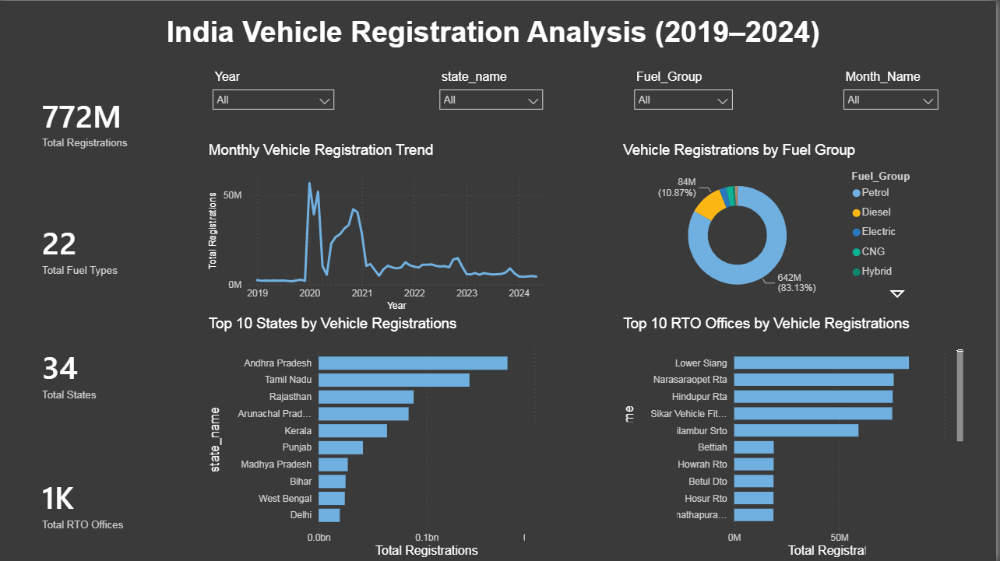

# India Vehicle Registration & Fuel Trend Analysis

An end-to-end data analytics project analyzing vehicle registration patterns across Indian states and RTO offices using **Python, Pandas, Matplotlib, and Power BI**.

The project focuses on understanding vehicle registration trends, fuel-type preferences, regional registration patterns, and electric vehicle adoption.

---

## Dashboard Preview



---

## Project Overview

This project analyzes vehicle registration data collected across Indian states and Regional Transport Offices (RTOs).

The analysis covers the period from **January 2019 to May 2024** and contains more than **418K vehicle registration records**.

The project follows an end-to-end data analytics workflow:

**Raw Dataset → Data Preprocessing → Data Validation → EDA → Power BI Dashboard → Business Insights**

---

## Project Objective

The main objective of this project is to transform vehicle registration data into meaningful insights that can help understand:

- Overall vehicle registration trends
- Fuel-type preferences across India
- State-wise registration patterns
- RTO-wise registration volumes
- Electric vehicle adoption
- Changes in fuel preferences over time

The project demonstrates how Python can be used for data preparation and exploratory analysis, followed by Power BI for interactive business reporting.

---

## Dataset

The dataset contains vehicle registration information at the state and RTO-office level.

### Dataset Features

| Column | Description |
|---|---|
| `id` | Unique record identifier |
| `date` | Vehicle registration date |
| `state_name` | Name of the state/region |
| `state_code` | State identification code |
| `office_name` | RTO office name |
| `office_code` | RTO office code |
| `fuel_type` | Original vehicle fuel type |
| `category` | Vehicle category |
| `registrations` | Number of vehicle registrations |
| `Year` | Registration year |
| `Month` | Registration month number |
| `Month_Name` | Registration month |
| `Quarter` | Registration quarter |
| `Fuel_Group` | Grouped fuel category |
| `Day` | Day of registration |
| `Year_Month` | Year and month for trend analysis |

### Dataset Coverage

- **Records:** 418K+
- **States/Regions:** 34
- **RTO Offices:** 1,414
- **Fuel Types:** 22
- **Time Period:** January 2019 – May 2024

---

## Tools & Technologies

**Data Processing & Analysis**
- Python
- Pandas
- NumPy
- Matplotlib
- Jupyter Notebook

**Business Intelligence**
- Microsoft Power BI
- DAX
- Data Visualization
- Interactive Dashboarding

---

## Data Preprocessing

The dataset was cleaned and prepared using Python and Pandas before being used in Power BI.

Steps included:

- Inspected dataset structure and data types
- Converted the `date` column to datetime format
- Standardized fuel-type values
- Created a grouped `Fuel_Group` category
- Checked for missing values
- Checked for duplicate records
- Validated registration values
- Created date-based analytical features
- Performed exploratory data analysis
- Exported the cleaned dataset for Power BI

### Data Quality Validation

| Validation Check | Result |
|---|---|
| Missing Values | None |
| Duplicate Records | None |
| Negative Registration Values | None |
| Zero Registration Values | None |
| Date Values | Valid |
| Fuel Categories | Standardized |

---

## Fuel Type Standardization

The original dataset contains 22 different fuel types, including:

Petrol, Diesel, Electric, Pure EV, Petrol/Hybrid, Strong Hybrid EV, Plug-In Hybrid EV, Petrol/CNG, CNG Only, Petrol/LPG, LPG Only, Ethanol, LNG, Methanol, Solar, Fuel Cell Hydrogen.

To simplify analysis, a separate `Fuel_Group` column was created.

### Example Mapping

| Original Fuel Type | Fuel Group |
|---|---|
| Petrol | Petrol |
| Diesel | Diesel |
| Electric | Electric |
| Pure EV | Electric |
| Petrol/Hybrid | Hybrid |
| Strong Hybrid EV | Hybrid |
| Plug-In Hybrid EV | Hybrid |
| Petrol/CNG | CNG |
| CNG Only | CNG |
| Petrol/LPG | LPG |
| LPG Only | LPG |
| Ethanol | Ethanol |
| LNG | LNG |
| Methanol | Alternative Fuel |
| Solar | Alternative Fuel |
| Fuel Cell Hydrogen | Alternative Fuel |

The original `fuel_type` column was retained to preserve the detailed information in the source data.

---

## Exploratory Data Analysis

The following areas were explored using Python:

**Overall Registration Analysis**
- Total vehicle registrations
- Registration volume over time
- Year-wise registration trends
- Monthly registration trends

**Fuel Analysis**
- Registration distribution by fuel type
- Registration distribution by fuel group
- Petrol vs Diesel registrations
- Alternative fuel adoption

**Geographic Analysis**
- State-wise vehicle registrations
- Top 10 states by registrations
- RTO-wise registration volumes
- Top 10 RTO offices

**Electric Vehicle Analysis**
- Total EV registrations
- EV registration trends
- Top states by EV registrations
- Regional EV adoption patterns

---

## Power BI Dashboard

The final dashboard was created in Microsoft Power BI.

### Dashboard Components

**KPI Cards**
- Total Vehicle Registrations
- Total States/Regions
- Total RTO Offices
- Total Fuel Types

**Visualizations**
- Monthly Vehicle Registration Trend
- Fuel Group Distribution
- Top 10 States by Registrations
- Top 10 RTO Offices
- Electric Vehicle Analysis

**Interactive Filters**
- Year
- Month
- State
- Fuel Group

The dashboard allows users to dynamically filter the analysis and explore registration patterns across different time periods, locations, and fuel categories.

---

## Key Insights

**1. Petrol and Diesel Remain Major Fuel Categories**
Traditional fuels such as Petrol and Diesel account for a substantial portion of overall vehicle registrations, indicating their continued dominance during the analyzed period.

**2. Alternative Fuel Adoption is Visible**
The dataset contains registrations across several alternative fuel categories, including Electric, Hybrid, CNG, LPG, Ethanol, LNG, Hydrogen, and Solar. This indicates increasing diversification in vehicle fuel technology and provides an opportunity to analyze the transition away from conventional fuels.

**3. EV Adoption Varies Across States**
Electric vehicle registrations are not evenly distributed across India. Some states contribute significantly more EV registrations than others, highlighting differences in regional EV adoption. Possible contributing factors include:
- Charging infrastructure
- Government incentives
- Urbanization
- Consumer awareness
- Availability of EV models

**4. Vehicle Registrations are Concentrated in Major RTOs**
A relatively small number of RTO offices account for a significant share of total registrations, reflecting the concentration of vehicle activity around major cities and economically active regions.

**5. Registration Volumes Change Over Time**
Monthly registration analysis shows fluctuations in vehicle registration activity across the analyzed period. Time-series analysis helps identify high- and low-registration periods, seasonal patterns, and changes in registration activity.

**6. Fuel Preference Differs by Region**
Different states show different fuel mixes. Some regions have a stronger concentration of conventional fuel registrations, while others show relatively higher adoption of alternative fuel categories such as CNG, Hybrid, or Electric.

---

## Business Questions Answered

1. How many vehicles were registered during the selected period?
2. Which fuel type has the highest registration volume?
3. Which fuel category dominates overall registrations?
4. Which states have the highest vehicle registrations?
5. Which RTO offices handle the highest registration volumes?
6. How have vehicle registrations changed over time?
7. Which states have the highest EV registrations?
8. How does fuel preference vary across states?
9. How does the fuel mix change over time?
10. What patterns can be observed in India's transition toward alternative fuel vehicles?

---

## Project Structure

```
india-vehicle-registration-analysis/
│
├── vehicle_registration_cleaned.csv
├── Data_Preprocessing_and_EDA.py
├── Vehicle_Registration_Analysis.pbix
├── screenshots/
│   └── dashboard.png
└── README.md
```

---

## Project Workflow

```
Vehicle Registration Dataset
            │
            ▼
      Python / Pandas
            │
            ▼
Data Cleaning & Validation
            │
            ▼
   Feature Engineering
            │
            ▼
Exploratory Data Analysis
            │
            ▼
       Clean Dataset
            │
            ▼
          Power BI
            │
            ▼
      DAX Measures
            │
            ▼
 Interactive Dashboard
            │
            ▼
    Business Insights
```

---

## How to Use This Project

**1. Clone the Repository**
```
git clone https://github.com/YOUR_USERNAME/india-vehicle-registration-analysis.git
```

**2. Explore the Python Analysis**

Open `Data_Preprocessing_and_EDA.py`. The Python workflow covers data preprocessing, validation, exploratory analysis, and visualization.

**3. Explore the Power BI Dashboard**

Open `Vehicle_Registration_Analysis.pbix` in Microsoft Power BI Desktop.

**4. Use the Dashboard Filters**

Use the available slicers to explore the data by Year, Month, State, and Fuel Group.

---

## Skills Demonstrated

Data Cleaning, Data Preprocessing, Data Validation, Exploratory Data Analysis, Feature Engineering, Python, Pandas, NumPy, Matplotlib, Power BI, DAX, Data Visualization, Dashboard Development, KPI Analysis, Business Intelligence, Business Insight Generation
